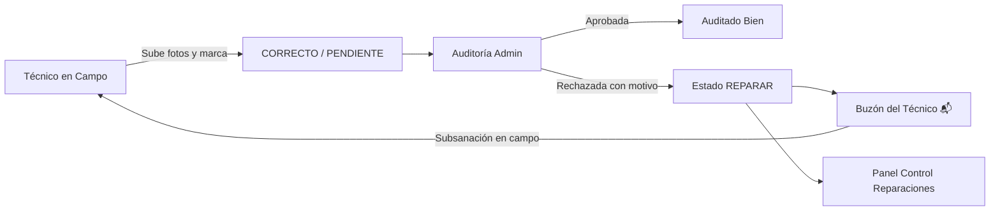

# 📸 Guía de Auditoría Fotográfica y Flujo de Reparaciones

Esta guía documenta el funcionamiento técnico y operacional del módulo de validación visual de evidencias fotográficas y el ciclo de vida del nuevo estado **REPARAR**.

---

## 1. Panel de Auditoría Visual (`/admin/photo-audit`)

El panel de auditoría permite a los supervisores inspeccionar a gran velocidad cientos de cajas y fotos tomadas en campo por los técnicos.

### Modos de Trabajo Disponibles

#### A. Modo Scroll (Auto-Auditoría bajo demanda)
- **Comportamiento**: Al activarse el botón `[ ⚡ Modo Scroll: ACTIVADO ]`, las CTOs que se van dejando atrás al desplazarse hacia abajo en la pantalla quedan automáticamente validadas como auditadas.
- **Configuración segura**: Inicia desactivado (`false`) por defecto para evitar aprobaciones involuntarias.
- **Contador Dinámico**: Un marcador superior contabiliza en tiempo real:
  - Total de CTOs revisadas.
  - Cajas aprobadas en sesión.
  - CTOs pendientes de auditar.
  - Cajas incompletas (cerradas sin subir el cupo de fotos).

#### B. Modo Táctil (Interfaz Gestual / Tinder-Style)
- Diseñado para auditoría ultrarrápida desde móviles, tablets o ratón:
  - **Deslizar a la derecha / Botón Verde**: Valida la CTO como **CORRECTO** (fotos aprobadas).
  - **Deslizar a la izquierda / Botón Morado**: Abre el selector de motivos y marca la caja en estado **REPARAR**.
  - **Botón Rojo (Abajo)**: Marca la caja como **FALLO**.
- **Zoom y rotación**: Soporta visualización ampliada de evidencias y rotación de imágenes si se tomaron en orientación horizontal/vertical invertida.

---

## 2. Flujo del Estado REPARAR

El estado **REPARAR** se incorpora para separar incidencias que requieren una subsanación física o fotográfica por parte del técnico responsable.

### Acciones Automáticas al enviar a REPARAR:
1. La CTO cambia su `status` a `"REPARAR"`.
2. Se guarda un registro en `Comment` con el prefijo `[REPARACIÓN SOLICITADA]: {motivo}` indicando el autor y la hora.
3. Se añade una entrada en la tabla `History` registrando el cambio para auditoría formal.
4. Aparece de forma prioritaria en el buzón personal del técnico asignado a esa caja.

---

## 3. Panel de Control de CTOs en REPARAR (`/admin/repair`)

Herramienta administrativa para seguimiento de taller e incidencias:
- **Filtro por Técnico Asignado**: Muestra el recuento de cajas pendientes por cada trabajador.
- **Filtro por Clúster / Zona**: Para planificar visitas geográficas en ruta.
- **Buscador de Texto**: Búsqueda inmediata por código de CTO, nuevo número o notas.
- **Visualización de Motivo**: Muestra el motivo exacto, fecha y supervisor que solicitó la reparación.
- **Reasignación Rápida**: Permite transferir la CTO a otro técnico o cambiar su estado directamente.
- **Exportación CSV**: Descarga en formato Excel/CSV con el listado completo de cajas pendientes de reparación.

---

## 4. Buzón de Notificaciones para Técnicos (Pantalla Principal)

- El icono de buzón (**📬**) solo se muestra en la cabecera si el usuario logueado tiene CTOs asignadas en estado `REPARAR`.
- Incluye un contador con las cajas pendientes de subsanar.
- Al abrir el buzón, el técnico visualiza:
  - Número de CTO y clúster.
  - Motivo exacto escrito por el auditor (ej. *"Falta foto de potencia dBm"* o *"Etiquetado ilegible"*).
  - Botón directo para abrir la ficha de la CTO y subir las nuevas evidencias requeridas.
